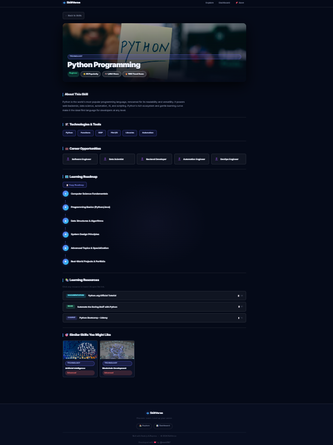
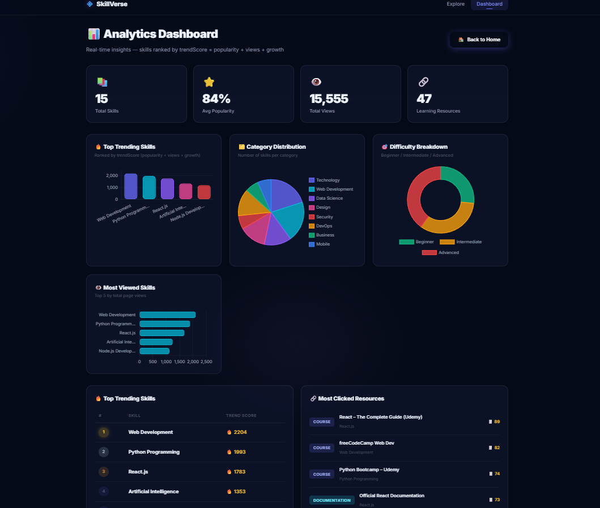

# 🚀 SkillVerse – Interactive Skill Discovery Platform

> A full-stack **Node.js web application** for discovering, exploring, and analyzing in-demand technology skills through a modern discovery platform powered by a real-time trend ranking algorithm.

🌐 **Live Demo:**  
https://skillverse-3iam.onrender.com/

---

# 🌟 Project Overview

**SkillVerse** helps learners and developers explore trending technology skills, discover structured learning paths, access curated learning resources, and analyze technology trends using an interactive analytics dashboard.

The platform ranks skills dynamically using a **trend score algorithm** and presents them through a modern card-based UI inspired by technology discovery platforms.

---

# 🖼 Screenshots

### 🏠 Home — Explore Skills


### 📄 Skill Detail Page


### 📊 Analytics Dashboard


---

# ✨ Features

| Feature | Description |
|---|---|
| 🔥 **Trend Ranking Algorithm** | Skills ranked using `trendScore = popularity + views + growth` |
| 🔎 **Smart Search + Auto-Suggest** | Instant search with category detection and dropdown suggestions |
| 📄 **Skill Detail Pages** | View skill description, technologies, career paths, roadmap, and learning resources |
| ⭐ **Bookmark Skills** | Save favorite skills using browser localStorage |
| 📋 **Copy Learning Roadmap** | One-click copy of the skill learning roadmap |
| 📊 **Analytics Dashboard** | Interactive charts and statistics powered by Chart.js |
| 🧠 **Recommendation Engine** | Suggests related skills based on category |
| 📚 **Learning Resources** | Curated tutorials, courses, and documentation |
| 🎨 **Modern UI** | Dark theme with glassmorphism design and smooth animations |

---

# ⚙️ Tech Stack

### Backend
- Node.js
- Express.js

### Frontend
- HTML5
- CSS3
- Vanilla JavaScript

### Data Storage
- JSON (`data/skills.json`) — flat-file database

### Charts & Visualization
- Chart.js

### Fonts
- Google Fonts — Inter

### Images
- Technology images from Unsplash

---

# 📂 Project Structure

```
skillverse/
│
├── app.js                     # Express server entry point
│
├── data/
│   └── skills.json            # Skills dataset (single source of truth)
│
├── routes/
│   ├── skills.js              # API routes for skills
│   └── resources.js           # Resource click tracking API
│
├── utils/
│   ├── ranking.js             # Trend score algorithm
│   ├── recommendation.js      # Skill recommendation engine
│   └── roadmap.js             # Learning roadmap generator
│
├── screenshots/
│   ├── home.png               # Home / Explore page
│   ├── skill-detail.png       # Skill detail page
│   └── dashboard.png          # Analytics dashboard
│
└── public/
    ├── index.html             # Homepage — skill cards
    ├── skill.html             # Skill detail page
    ├── dashboard.html         # Analytics dashboard
    │
    ├── css/
    │   └── style.css          # UI styling
    │
    └── js/
        ├── main.js            # Card rendering and UI interactions
        ├── search.js          # Search and filtering
        ├── dashboard.js       # Chart.js analytics dashboard
        └── resources.js       # Resource click tracking
```

---

# 🚀 Getting Started

## Prerequisites

Make sure you have installed:

- Node.js (v18 or higher)

---

## Install & Run

```bash
git clone https://github.com/mash157/SkillVerse.git
cd skillverse
npm install
node app.js
```

Open in browser:

```
http://localhost:3000
```

---

# 🔗 API Endpoints

| Method | Endpoint | Description |
|---|---|---|
| GET | `/api/skills` | Get all skills with filtering options |
| GET | `/api/skills/suggest?q=` | Smart search suggestions |
| GET | `/api/skills/categories` | List all skill categories |
| GET | `/api/skills/dashboard` | Dashboard analytics data |
| GET | `/api/skills/:id` | Get skill details (increments views) |
| POST | `/api/resource-click` | Track learning resource clicks |

---

# 🧮 Trend Score Algorithm

```
trendScore = popularity + views + growth
```

### Variables

- **popularity** → curated relevance score (0–100)
- **views** → incremented when a skill detail page is opened
- **growth** → estimated yearly demand growth

Skills are sorted by **trendScore** on the homepage.

---

# 📚 Skills Included

Artificial Intelligence  
Web Development  
Machine Learning  
UI/UX Design  
Node.js  
Data Science  
React.js  
Cybersecurity  
DevOps & CI/CD  
Figma  
Digital Marketing  
Blockchain  
Python  
Mobile App Development  
Cloud Computing (AWS)

---

# 🎯 Project Goal

SkillVerse aims to provide an interactive platform where users can:

- Discover trending technology skills
- Explore structured learning paths
- Access curated learning resources
- Analyze skill popularity and trends

---

# 👨‍💻 Author

Developed by **@mash157**

Built with ❤️ using **Node.js, Express, and modern frontend technologies**

© 2026 SkillVerse